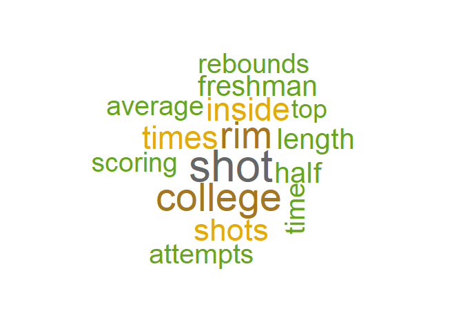
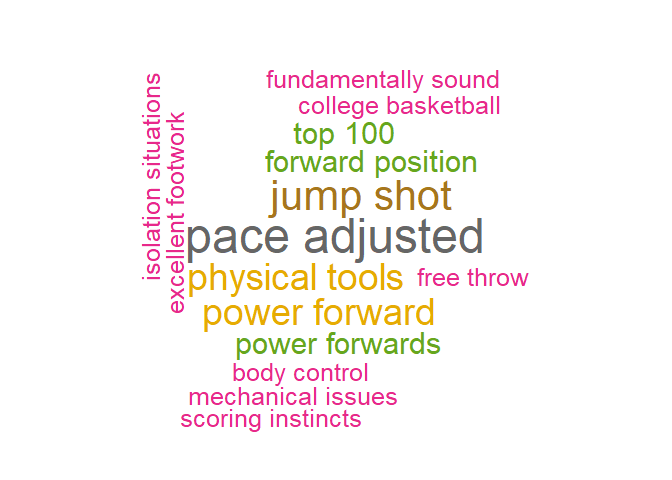
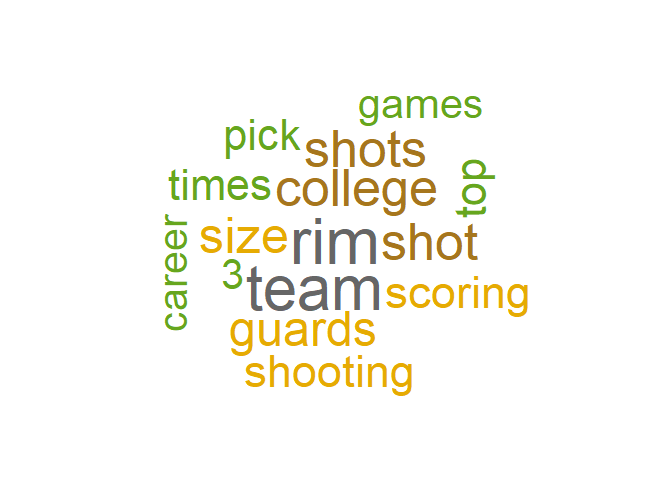
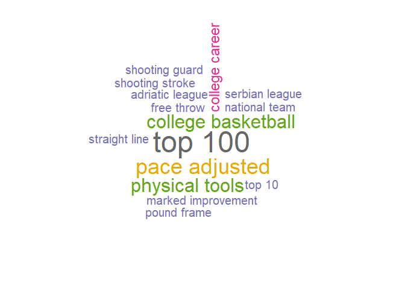
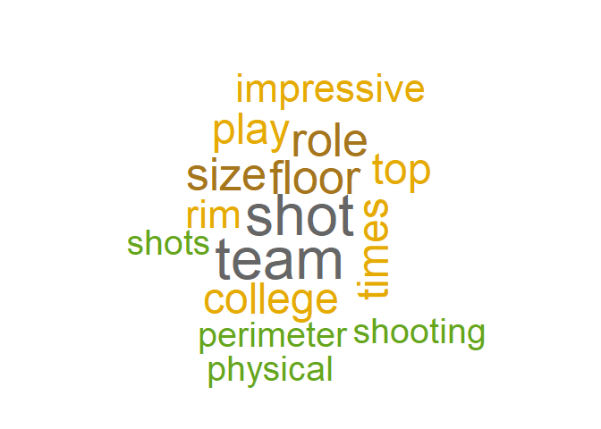
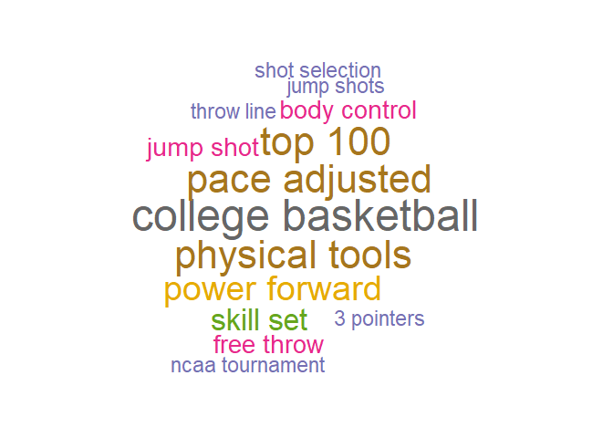
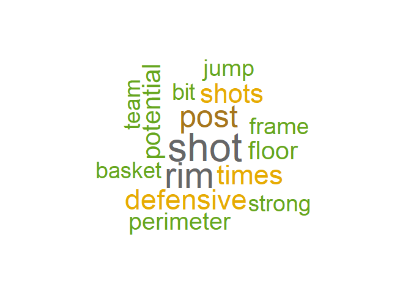
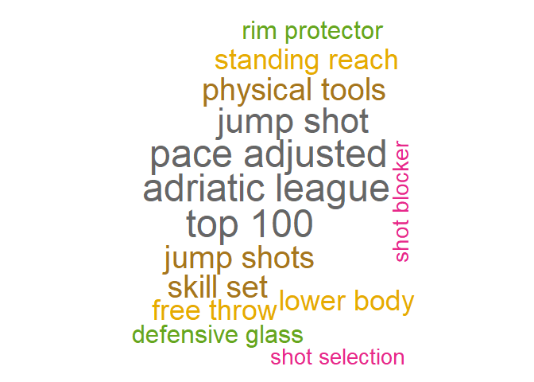
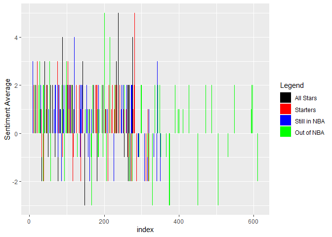

2016 NBA Draft Scouting Reports Text Analysis
================
Eric Trempe

I was interested in comparing the pre-draft scouting reports of
different levels of players in the NBA today. I split players drafted in
2016 into four different categories: All-Star players, Starter level
players (players who get around 30+ minutes per game), role players who
are still in the NBA but do not play very much, and players who are no
longer active in the league (they have either retired, remained
unsigned, or moved to another pro league). I decided to do text analysis
on these scouting reports for the different groups to see if there are
indicators of success hidden in these reports.

I started by finding the most common words and pairings of two words
used in scouting reports for players of each category. I was hoping to
find traits that do not always show up in traditional statistics that
impact winning. Since these traits would not show up in other
statistics, text analysis provides another opportunity for analyzing
player impact and what makes a player successful. The tables and
associated word clouds provide counts of 15 most common and meaningful
words and phrases in each group of players.

## All-Star Players

<table>
<thead>
<tr>
<th style="text-align:left;">
word
</th>
<th style="text-align:right;">
n
</th>
</tr>
</thead>
<tbody>
<tr>
<td style="text-align:left;">
shot
</td>
<td style="text-align:right;">
23
</td>
</tr>
<tr>
<td style="text-align:left;">
college
</td>
<td style="text-align:right;">
20
</td>
</tr>
<tr>
<td style="text-align:left;">
rim
</td>
<td style="text-align:right;">
19
</td>
</tr>
<tr>
<td style="text-align:left;">
inside
</td>
<td style="text-align:right;">
16
</td>
</tr>
<tr>
<td style="text-align:left;">
times
</td>
<td style="text-align:right;">
16
</td>
</tr>
<tr>
<td style="text-align:left;">
shots
</td>
<td style="text-align:right;">
15
</td>
</tr>
<tr>
<td style="text-align:left;">
freshman
</td>
<td style="text-align:right;">
14
</td>
</tr>
<tr>
<td style="text-align:left;">
half
</td>
<td style="text-align:right;">
14
</td>
</tr>
<tr>
<td style="text-align:left;">
length
</td>
<td style="text-align:right;">
14
</td>
</tr>
<tr>
<td style="text-align:left;">
attempts
</td>
<td style="text-align:right;">
13
</td>
</tr>
<tr>
<td style="text-align:left;">
average
</td>
<td style="text-align:right;">
13
</td>
</tr>
<tr>
<td style="text-align:left;">
rebounds
</td>
<td style="text-align:right;">
13
</td>
</tr>
<tr>
<td style="text-align:left;">
scoring
</td>
<td style="text-align:right;">
13
</td>
</tr>
<tr>
<td style="text-align:left;">
time
</td>
<td style="text-align:right;">
13
</td>
</tr>
<tr>
<td style="text-align:left;">
jump
</td>
<td style="text-align:right;">
12
</td>
</tr>
<tr>
<td style="text-align:left;">
offensive
</td>
<td style="text-align:right;">
12
</td>
</tr>
<tr>
<td style="text-align:left;">
tools
</td>
<td style="text-align:right;">
12
</td>
</tr>
<tr>
<td style="text-align:left;">
top
</td>
<td style="text-align:right;">
12
</td>
</tr>
</tbody>
</table>

<!-- -->

There are a few NBA game related words that stick out from this word
cloud including scoring, rebounds, shot(s), and attempts. These make
sense because players who found All-Star level success in the NBA are
typically strong scorers and/or rebounders. Shot and attempts also makes
sense because star players typically take and make more shots during a
game. Length is another word that stuck out to me because in the modern
NBA, having long arms and height (commonly referred to as length by the
NBA crowd) are very helpful traits to avoid defenders and defend others
at a high level. College and freshman were also meaningful because many
top draft picks are players declaring for the NBA after one college
season in the NCAA. This is because of the rules regarding entering the
draft that require players to have either on year of college or
alternate league play before they are eligible for the draft. As a
result the best players typically declare for the draft after their
freshman season because they will get drafted early and can then make a
lot of money.

<table>
<thead>
<tr>
<th style="text-align:left;">
bigrams
</th>
<th style="text-align:right;">
n
</th>
</tr>
</thead>
<tbody>
<tr>
<td style="text-align:left;">
pace adjusted
</td>
<td style="text-align:right;">
7
</td>
</tr>
<tr>
<td style="text-align:left;">
jump shot
</td>
<td style="text-align:right;">
6
</td>
</tr>
<tr>
<td style="text-align:left;">
physical tools
</td>
<td style="text-align:right;">
5
</td>
</tr>
<tr>
<td style="text-align:left;">
power forward
</td>
<td style="text-align:right;">
5
</td>
</tr>
<tr>
<td style="text-align:left;">
forward position
</td>
<td style="text-align:right;">
4
</td>
</tr>
<tr>
<td style="text-align:left;">
power forwards
</td>
<td style="text-align:right;">
4
</td>
</tr>
<tr>
<td style="text-align:left;">
top 100
</td>
<td style="text-align:right;">
4
</td>
</tr>
<tr>
<td style="text-align:left;">
body control
</td>
<td style="text-align:right;">
3
</td>
</tr>
<tr>
<td style="text-align:left;">
college basketball
</td>
<td style="text-align:right;">
3
</td>
</tr>
<tr>
<td style="text-align:left;">
excellent footwork
</td>
<td style="text-align:right;">
3
</td>
</tr>
<tr>
<td style="text-align:left;">
free throw
</td>
<td style="text-align:right;">
3
</td>
</tr>
<tr>
<td style="text-align:left;">
fundamentally sound
</td>
<td style="text-align:right;">
3
</td>
</tr>
<tr>
<td style="text-align:left;">
isolation situations
</td>
<td style="text-align:right;">
3
</td>
</tr>
<tr>
<td style="text-align:left;">
lower body
</td>
<td style="text-align:right;">
3
</td>
</tr>
<tr>
<td style="text-align:left;">
mechanical issues
</td>
<td style="text-align:right;">
3
</td>
</tr>
<tr>
<td style="text-align:left;">
scoring instincts
</td>
<td style="text-align:right;">
3
</td>
</tr>
</tbody>
</table>

<!-- -->

The bigrams were even more telling because they give more context.
Physical tools relates to length from the prior cloud, college shows up
once again, and scoring instincts is related to score and shots from the
single word cloud as well. Fundamentally sound, excellent footwork, and
jump shot were all in there as well as basketball related skills that
would stick out in elite players. However, there was a negative sounding
trait that stuck out in this cloud: mechanical issues. This is
interesting because you would think that players who turn out to be All
Stars in the NBA would have good mechanics. It could be something that
was a concern but then rectified thanks to these other positive traits.
Finally, forward position and power forwards showed up which is
interesting because that is only one specific position in basketball. I
think that many of the people from this group in this specific draft
class played that position so that could be an anomaly for All Stars in
general.

## Starter Level Players

<table>
<thead>
<tr>
<th style="text-align:left;">
word
</th>
<th style="text-align:right;">
n
</th>
</tr>
</thead>
<tbody>
<tr>
<td style="text-align:left;">
rim
</td>
<td style="text-align:right;">
24
</td>
</tr>
<tr>
<td style="text-align:left;">
team
</td>
<td style="text-align:right;">
23
</td>
</tr>
<tr>
<td style="text-align:left;">
college
</td>
<td style="text-align:right;">
19
</td>
</tr>
<tr>
<td style="text-align:left;">
shot
</td>
<td style="text-align:right;">
19
</td>
</tr>
<tr>
<td style="text-align:left;">
shots
</td>
<td style="text-align:right;">
19
</td>
</tr>
<tr>
<td style="text-align:left;">
size
</td>
<td style="text-align:right;">
18
</td>
</tr>
<tr>
<td style="text-align:left;">
guards
</td>
<td style="text-align:right;">
17
</td>
</tr>
<tr>
<td style="text-align:left;">
scoring
</td>
<td style="text-align:right;">
16
</td>
</tr>
<tr>
<td style="text-align:left;">
shooting
</td>
<td style="text-align:right;">
16
</td>
</tr>
<tr>
<td style="text-align:left;">
pick
</td>
<td style="text-align:right;">
15
</td>
</tr>
<tr>
<td style="text-align:left;">
times
</td>
<td style="text-align:right;">
15
</td>
</tr>
<tr>
<td style="text-align:left;">
top
</td>
<td style="text-align:right;">
15
</td>
</tr>
<tr>
<td style="text-align:left;">
3
</td>
<td style="text-align:right;">
14
</td>
</tr>
<tr>
<td style="text-align:left;">
basketball
</td>
<td style="text-align:right;">
14
</td>
</tr>
<tr>
<td style="text-align:left;">
career
</td>
<td style="text-align:right;">
14
</td>
</tr>
<tr>
<td style="text-align:left;">
games
</td>
<td style="text-align:right;">
14
</td>
</tr>
</tbody>
</table>

<!-- -->

Once again for the starter level solid NBA players, shooting, scoring,
and shots were all commonly used. Scoring is a very important in the
modern NBA so these traits would lead to success in the NBA. College is
once again present, and team is very prevalent for this cloud which
suggests these players are team oriented which would obviously be
considered a positive trait and contribute to NBA sucess. Size was in
this time instead of length but that tells a similar story. One large
difference here is that many of these players were guards since that
showed up instead of forwards like the All Star group.

<table>
<thead>
<tr>
<th style="text-align:left;">
bigrams
</th>
<th style="text-align:right;">
n
</th>
</tr>
</thead>
<tbody>
<tr>
<td style="text-align:left;">
top 100
</td>
<td style="text-align:right;">
10
</td>
</tr>
<tr>
<td style="text-align:left;">
pace adjusted
</td>
<td style="text-align:right;">
7
</td>
</tr>
<tr>
<td style="text-align:left;">
college basketball
</td>
<td style="text-align:right;">
6
</td>
</tr>
<tr>
<td style="text-align:left;">
physical tools
</td>
<td style="text-align:right;">
6
</td>
</tr>
<tr>
<td style="text-align:left;">
college career
</td>
<td style="text-align:right;">
4
</td>
</tr>
<tr>
<td style="text-align:left;">
adriatic league
</td>
<td style="text-align:right;">
3
</td>
</tr>
<tr>
<td style="text-align:left;">
free throw
</td>
<td style="text-align:right;">
3
</td>
</tr>
<tr>
<td style="text-align:left;">
marked improvement
</td>
<td style="text-align:right;">
3
</td>
</tr>
<tr>
<td style="text-align:left;">
national team
</td>
<td style="text-align:right;">
3
</td>
</tr>
<tr>
<td style="text-align:left;">
pound frame
</td>
<td style="text-align:right;">
3
</td>
</tr>
<tr>
<td style="text-align:left;">
serbian league
</td>
<td style="text-align:right;">
3
</td>
</tr>
<tr>
<td style="text-align:left;">
shooting guard
</td>
<td style="text-align:right;">
3
</td>
</tr>
<tr>
<td style="text-align:left;">
shooting stroke
</td>
<td style="text-align:right;">
3
</td>
</tr>
<tr>
<td style="text-align:left;">
shot creator
</td>
<td style="text-align:right;">
3
</td>
</tr>
<tr>
<td style="text-align:left;">
straight line
</td>
<td style="text-align:right;">
3
</td>
</tr>
<tr>
<td style="text-align:left;">
thin frame
</td>
<td style="text-align:right;">
3
</td>
</tr>
<tr>
<td style="text-align:left;">
top 10
</td>
<td style="text-align:right;">
3
</td>
</tr>
</tbody>
</table>

<!-- -->

The main new bigram of note is the top 100 which was the most common
bigram in the cloud. I believe that based on what I read in the
individual reports, this is referring to top 100 recruits coming out of
high school. This means that many of these starter level players were
high recruits going in to college which makes sense. In addition to
college basketball now there are two other leagues of play (plus
national team play) that show up in the cloud. Adriatic league and
Serbian league both appear which means this group had some international
draft prospects. While these words are less prevalent for this group
than NCAA college basketball, there is more diversity in which league
the players came from before the draft. Another key phrase in there is
marked improvement, which I think makes sense because many of these
players were drafted in the middle of the first round, which means they
were not expected to be high level players, but they showed improvement
in the past and must have again to become this starter level player in
the NBA.

## Players Still in the NBA

<table>
<thead>
<tr>
<th style="text-align:left;">
word
</th>
<th style="text-align:right;">
n
</th>
</tr>
</thead>
<tbody>
<tr>
<td style="text-align:left;">
shot
</td>
<td style="text-align:right;">
25
</td>
</tr>
<tr>
<td style="text-align:left;">
team
</td>
<td style="text-align:right;">
25
</td>
</tr>
<tr>
<td style="text-align:left;">
floor
</td>
<td style="text-align:right;">
20
</td>
</tr>
<tr>
<td style="text-align:left;">
role
</td>
<td style="text-align:right;">
20
</td>
</tr>
<tr>
<td style="text-align:left;">
size
</td>
<td style="text-align:right;">
19
</td>
</tr>
<tr>
<td style="text-align:left;">
college
</td>
<td style="text-align:right;">
18
</td>
</tr>
<tr>
<td style="text-align:left;">
play
</td>
<td style="text-align:right;">
18
</td>
</tr>
<tr>
<td style="text-align:left;">
times
</td>
<td style="text-align:right;">
18
</td>
</tr>
<tr>
<td style="text-align:left;">
top
</td>
<td style="text-align:right;">
18
</td>
</tr>
<tr>
<td style="text-align:left;">
impressive
</td>
<td style="text-align:right;">
16
</td>
</tr>
<tr>
<td style="text-align:left;">
rim
</td>
<td style="text-align:right;">
16
</td>
</tr>
<tr>
<td style="text-align:left;">
perimeter
</td>
<td style="text-align:right;">
14
</td>
</tr>
<tr>
<td style="text-align:left;">
physical
</td>
<td style="text-align:right;">
14
</td>
</tr>
<tr>
<td style="text-align:left;">
shooting
</td>
<td style="text-align:right;">
14
</td>
</tr>
<tr>
<td style="text-align:left;">
shots
</td>
<td style="text-align:right;">
14
</td>
</tr>
</tbody>
</table>

<!-- -->

These players have spent there careers as more of role players so role
being one of the most common words from these scouting reports makes
perfect sense in their projections. There are still lots of positive
remarks about these players like impressive and team, but some of the
words from earlier like excellent and sound are less common for these
players as opposed to the more star level players.

<table>
<thead>
<tr>
<th style="text-align:left;">
bigrams
</th>
<th style="text-align:right;">
n
</th>
</tr>
</thead>
<tbody>
<tr>
<td style="text-align:left;">
college basketball
</td>
<td style="text-align:right;">
8
</td>
</tr>
<tr>
<td style="text-align:left;">
pace adjusted
</td>
<td style="text-align:right;">
7
</td>
</tr>
<tr>
<td style="text-align:left;">
physical tools
</td>
<td style="text-align:right;">
7
</td>
</tr>
<tr>
<td style="text-align:left;">
top 100
</td>
<td style="text-align:right;">
7
</td>
</tr>
<tr>
<td style="text-align:left;">
power forward
</td>
<td style="text-align:right;">
6
</td>
</tr>
<tr>
<td style="text-align:left;">
power forwards
</td>
<td style="text-align:right;">
6
</td>
</tr>
<tr>
<td style="text-align:left;">
skill set
</td>
<td style="text-align:right;">
5
</td>
</tr>
<tr>
<td style="text-align:left;">
body control
</td>
<td style="text-align:right;">
4
</td>
</tr>
<tr>
<td style="text-align:left;">
free throw
</td>
<td style="text-align:right;">
4
</td>
</tr>
<tr>
<td style="text-align:left;">
jump shot
</td>
<td style="text-align:right;">
4
</td>
</tr>
<tr>
<td style="text-align:left;">
3 pointers
</td>
<td style="text-align:right;">
3
</td>
</tr>
<tr>
<td style="text-align:left;">
jump shots
</td>
<td style="text-align:right;">
3
</td>
</tr>
<tr>
<td style="text-align:left;">
ncaa tournament
</td>
<td style="text-align:right;">
3
</td>
</tr>
<tr>
<td style="text-align:left;">
shot selection
</td>
<td style="text-align:right;">
3
</td>
</tr>
<tr>
<td style="text-align:left;">
throw line
</td>
<td style="text-align:right;">
3
</td>
</tr>
</tbody>
</table>

<!-- -->

This cloud returns to a similar place as the earlier two, so even though
these players did not enjoy quite as much success in the NBA, they had a
lot of the same traits coming in the NBA draft. College basketball is
very common while the other pro leagues from overseas do not appear in
this cloud, so much of this group is from the United States NCAA pool of
players.

## Players No Longer in the NBA

<table>
<thead>
<tr>
<th style="text-align:left;">
word
</th>
<th style="text-align:right;">
n
</th>
</tr>
</thead>
<tbody>
<tr>
<td style="text-align:left;">
shot
</td>
<td style="text-align:right;">
54
</td>
</tr>
<tr>
<td style="text-align:left;">
rim
</td>
<td style="text-align:right;">
48
</td>
</tr>
<tr>
<td style="text-align:left;">
post
</td>
<td style="text-align:right;">
41
</td>
</tr>
<tr>
<td style="text-align:left;">
defensive
</td>
<td style="text-align:right;">
37
</td>
</tr>
<tr>
<td style="text-align:left;">
times
</td>
<td style="text-align:right;">
36
</td>
</tr>
<tr>
<td style="text-align:left;">
shots
</td>
<td style="text-align:right;">
35
</td>
</tr>
<tr>
<td style="text-align:left;">
potential
</td>
<td style="text-align:right;">
33
</td>
</tr>
<tr>
<td style="text-align:left;">
floor
</td>
<td style="text-align:right;">
32
</td>
</tr>
<tr>
<td style="text-align:left;">
perimeter
</td>
<td style="text-align:right;">
30
</td>
</tr>
<tr>
<td style="text-align:left;">
frame
</td>
<td style="text-align:right;">
29
</td>
</tr>
<tr>
<td style="text-align:left;">
jump
</td>
<td style="text-align:right;">
29
</td>
</tr>
<tr>
<td style="text-align:left;">
basket
</td>
<td style="text-align:right;">
28
</td>
</tr>
<tr>
<td style="text-align:left;">
bit
</td>
<td style="text-align:right;">
28
</td>
</tr>
<tr>
<td style="text-align:left;">
pick
</td>
<td style="text-align:right;">
28
</td>
</tr>
<tr>
<td style="text-align:left;">
strong
</td>
<td style="text-align:right;">
28
</td>
</tr>
<tr>
<td style="text-align:left;">
team
</td>
<td style="text-align:right;">
28
</td>
</tr>
</tbody>
</table>

<!-- -->

The main word that sticks out to me in this group is potential. Players
are always drafted because the organizations believe they have potential
to contribute to winning games. While potential is certainly not a
negative thing, the use of it in these scouting reports rather than
focusing on positive skills might be somewhat indicative of why they did
not make it in the league for as long. Some of these players were still
drafted very early on in 2016 but they did not appear to reach their
potential, which could be partially because they were behind their draft
classmates in other areas highlighted by the earlier word cloud. Another
really interesting part of this cloud that differs from the others is
defensive. There is an old saying “Defense wins championships” but based
on this study it seems as though offense is valued more in the NBA right
now. The first three groups had more words relating to shooting,
scoring, and free throws, but this group had defensive and post and
perimeter (which imply defense).

<table>
<thead>
<tr>
<th style="text-align:left;">
bigrams
</th>
<th style="text-align:right;">
n
</th>
</tr>
</thead>
<tbody>
<tr>
<td style="text-align:left;">
adriatic league
</td>
<td style="text-align:right;">
10
</td>
</tr>
<tr>
<td style="text-align:left;">
pace adjusted
</td>
<td style="text-align:right;">
10
</td>
</tr>
<tr>
<td style="text-align:left;">
top 100
</td>
<td style="text-align:right;">
10
</td>
</tr>
<tr>
<td style="text-align:left;">
jump shot
</td>
<td style="text-align:right;">
9
</td>
</tr>
<tr>
<td style="text-align:left;">
jump shots
</td>
<td style="text-align:right;">
8
</td>
</tr>
<tr>
<td style="text-align:left;">
physical tools
</td>
<td style="text-align:right;">
8
</td>
</tr>
<tr>
<td style="text-align:left;">
skill set
</td>
<td style="text-align:right;">
8
</td>
</tr>
<tr>
<td style="text-align:left;">
free throw
</td>
<td style="text-align:right;">
7
</td>
</tr>
<tr>
<td style="text-align:left;">
lower body
</td>
<td style="text-align:right;">
7
</td>
</tr>
<tr>
<td style="text-align:left;">
standing reach
</td>
<td style="text-align:right;">
7
</td>
</tr>
<tr>
<td style="text-align:left;">
defensive glass
</td>
<td style="text-align:right;">
6
</td>
</tr>
<tr>
<td style="text-align:left;">
rim protector
</td>
<td style="text-align:right;">
6
</td>
</tr>
<tr>
<td style="text-align:left;">
strong frame
</td>
<td style="text-align:right;">
6
</td>
</tr>
<tr>
<td style="text-align:left;">
5 rebounds
</td>
<td style="text-align:right;">
5
</td>
</tr>
<tr>
<td style="text-align:left;">
european championship
</td>
<td style="text-align:right;">
5
</td>
</tr>
<tr>
<td style="text-align:left;">
mid range
</td>
<td style="text-align:right;">
5
</td>
</tr>
<tr>
<td style="text-align:left;">
physical profile
</td>
<td style="text-align:right;">
5
</td>
</tr>
<tr>
<td style="text-align:left;">
shot blocker
</td>
<td style="text-align:right;">
5
</td>
</tr>
<tr>
<td style="text-align:left;">
shot selection
</td>
<td style="text-align:right;">
5
</td>
</tr>
</tbody>
</table>

<!-- -->

The bigram cloud has a few more offensive related traits like jump
shots, but defensive glass (defensive rebounding) is once again big as
well as another component of defense, shot blocker. But, what really
sticks out from this cloud is the return of the Adriatic league. This
other pro league is much more common for this group than college so many
of these players had a different background before the NBA. This
suggests that this pro league is less effective in preparing players for
successful NBA careers as opposed to the NCAA college basketball system.

Overall, these word clouds had many similarities among groups. There
were, however, some key differences that provide some insight into
potential differences between these players. Intangibles are often
described as ways a player affects the game that do not show up in
statistics. Scouting reports are meant in part to describe these
intangibles so this analysis shows how some of these traits affect NBA
success.

## Sentiment Analysis

I also wanted to analyze the connotation of the words used in these
scouting reports for each group of players. There could be a difference
in how the scouts write about the players who wind up finding success in
the NBA versus those who do not even though it is unknown at the time of
the writing. I started this by simply summing the sentiments of the
words in scouting reports from each player category.

All Star Players Sentiment Sum:

    ## [1] 43

Starter Level Players Sentiment Sum:

    ## [1] 40

Players Still in the NBA Sentiment Sum:

    ## [1] 42

Players No Longer in the NBA Sentiment Sum:

    ## [1] 33

The sentiment sums for the players still in the NBA today (including the
All Star and Starter Level players) were very similar, which suggests
that their scouting reports had a very similar proportion of positive
and negative words. I found that interesting because while level of
success has varied among these groups, they have still all managed to
stay active in the NBA for 6 years which is impressive. Perhaps this
level of positive vs negative words is the bar for finding some success
in the NBA.

I found it especially interesting that the players that are out of the
NBA had a lower sentiment sum. The sum (33) was still positive, meaning
more positive words than negative, but it was less positive than the
others. Even though some of these players were highly sought after and
projected to be NBA stars, they still, on average, had less positive
scouting reports about them. Having less positive words, or more
negative words, could represent red flags that in some way contributed
to less NBA success.

<!-- -->

This graph tells this same story visually. All four colors have mostly
positive sentiments, but it is clear that there are more green lines
below zero which makes sense considering the players no longer in the
NBA have a lower sentiment sum. As one would expect, more positivity in
a scouting report generally correlates to a longer and more illustrious
career in the NBA. The key here is that all the players remaining in the
league (no matter the level of play) had roughly the same sentiment
“scores,” and one that was better than their counterparts who did not
enjoy the same success in the NBA.
